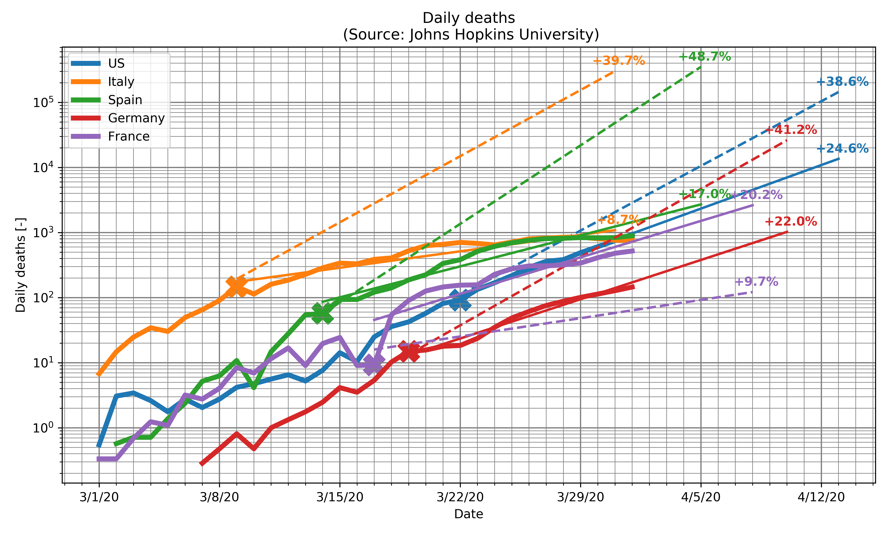
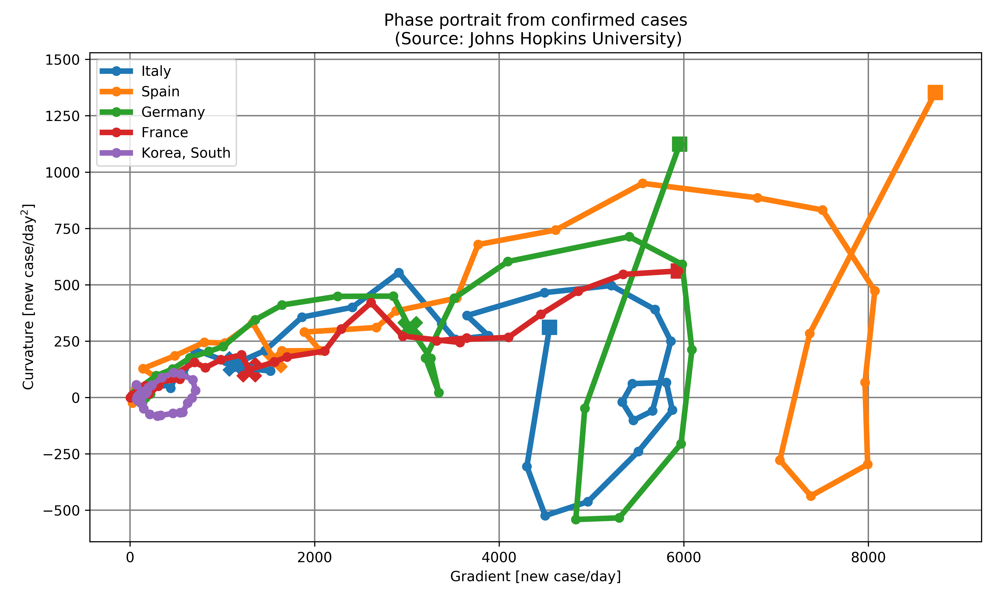

# COVID-19 Evolution Curves

Scripts to monitor the evolution of COVID-19 propagation for each countries, based on data aggregated by the Johns Hopkins University (https://github.com/CSSEGISandData/COVID-19).

### Prerequisites
Scripts were developped with Python 3.6.8, matplotlib 2.2.2, pandas 0.25.3 and scipy 1.2.0.

### Installation
To create a new virtual environment:

    $ virtualenv venv
    $ source venv/bin/activate
    
To install the dependencies:

    $ pip install -r requirements.txt 

### Getting Started
The two main scripts are:

1/ plotCorrelation.py (see Fig. 1)  
-> Plot the usual observables (confirmed cases, deaths, active cases) versus time. The observables can be show in the form of cumulated, daily value (gradient) or daily value variation (curvature)  
-> Curves can be smoothed with the Savitzky-Golay filter  
-> Exponential extrapolation is proposed based on data before (dashed line) and after (plain line) lockdown, if lockdown date is given.

2/ phase_diagram.py (see Fig. 2)  
-> plot the phase diagram of the usual observables.  
-> X-axis is the gradient (=new case/day) and Y-axis is the curvature (=variation of new case/day). The course of the epidemic can be well visualized in this phase diagram.

## Authors

* **Geoffroy Chaussonnet** - *Initial work* 
* **Julien Férard** - *Improvements, code maintenance*

## License

This project is licensed under the BSD 3 License - see the [LICENSE.md](LICENSE.md) file for details

